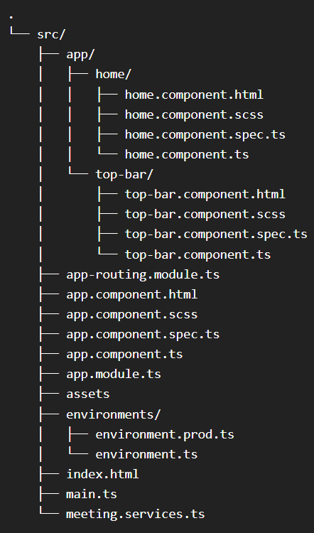

# VideoSDK for Ionic + Angular Demo (For Web)

[](https://)
[](https://discord.gg/kgAvyxtTxv)
[](https://app.videosdk.live/signup)

At Video SDK, we’re building tools to help companies create world-class collaborative products with capabilities of live audio/videos, compose cloud recordings/rtmp/hls and interaction APIs

## Setup Guide

- Sign up on [VideoSDK](https://app.videosdk.live/) and visit [API Keys](https://app.videosdk.live/api-keys) section to get your API key and Secret key.

- Get familiarized with [API key and Secret key](https://docs.videosdk.live/flutter/guide/video-and-audio-calling-api-sdk/signup-and-create-api)

- Get familiarized with [Token](https://docs.videosdk.live/flutter/guide/video-and-audio-calling-api-sdk/server-setup)


### Prerequisites

- Valid [Video SDK Account](https://app.videosdk.live/signup)

## Run the Sample App
### 0. File Structure of the project 

### 1. Clone the sample project

Clone the repository to your local environment.

```js
git clone https://github.com/videosdk-live/videosdk-rtc-Ionic-sdk-angular-example.git
cd Ionic-VideoSDKdemo/
```

### 2. Install the dependecies

Install all the dependecies to run the project.

```js
npm install
```

### 3. Update the enviroment.ts file

- Create a new file enviroment.ts inside `src/enviroments` and Copy the enviroment.example.ts file's data to enviroment.ts file

- Update the TOKEN in `enviroment.ts` file.Token would be generated from dashboard `https://app.videosdk.live/dashboard`

  ```js
  token: YOUR_TOKEN
  ```

### 4. Run the sample app

- Bingo, It's time to run app

  ```js
  Ionic serve
  ```
## Ionic For Android
Running `npm install -g @ionic/cli` installs the Ionic CLI globally on your system using Node Package Manager.
 ```js
npm install -g @ionic/cli  # Installs both Ionic CLI and Capacitor
  ```
If the Ionic CLI and Capacitor are already installed, you'll need to update them if any errors occur.
  
   ```js
npm update -g @ionic/cli 
  ```
  
In summary, 'ionic capacitor link' android is a command used to establish the necessary connections and configurations between your Ionic project and the Android platform
   ```js
  ionic capacitor link android 
  ```
  
  The purpose of running 'ionic cap sync' is to synchronize the web assets of your Ionic project with the native project created by Capacitor.
  ```js
 ionic cap sync 
  ```
 'Ionic capacitor run android' command is used to build and deploy your Ionic project to an Android device or emulator using Capacitor. However
'--verbose' flag allows you to get more detailed information during the build and deployment process.
```js
 ionic capacitor run android --verbose
  ```
  Running 'ionic build --prod' initiates the production build process for your Ionic application.
  The '--prod' flag triggers various optimizations to reduce the size of your application's files and improve its performance. This typically includes minification of JavaScript, CSS, and HTML files, as well as tree shaking to remove any unused code. 
  ```js
 ionic build --prod
  ```

 
 
 
## Key Concepts

- `Meeting` - A Meeting represents Real time audio and video communication.

  **`Note : Don't confuse with Room and Meeting keyword, both are same thing 😃`**

- `Sessions` - A particular duration you spend in a given meeting is a referred as session, you can have multiple session of a particular meetingId.
- `Participant` - Participant represents someone who is attending the meeting's session, `local partcipant` represents self (You), for this self, other participants are `remote participants`.
- `Stream` - Stream means video or audio media content that is either published by `local participant` or `remote participants`.


## Token Generation

Token is used to create and validate a meeting using API and also initialise a meeting.

🛠️ `Development Environment`:

- For development, you can use temporary token. Visit VideoSDK [dashboard](https://app.videosdk.live/api-keys) to generate temporary token.

🌐 `Production Environment`:

- For production, you have to set up an authentication server to authorize users. Follow our official example repositories to setup authentication server, [videosdk-rtc-api-server-examples](https://github.com/videosdk-live/videosdk-rtc-api-server-examples)


## Examples

### Examples for Conference

- [videosdk-rtc-prebuilt-examples](https://github.com/videosdk-live/videosdk-rtc-prebuilt-examples)
- [videosdk-rtc-javascript-sdk-example](https://github.com/videosdk-live/videosdk-rtc-javascript-sdk-example)
- [videosdk-rtc-react-sdk-examplee](https://github.com/videosdk-live/videosdk-rtc-react-sdk-example)
- [videosdk-rtc-react-native-sdk-example](https://github.com/videosdk-live/videosdk-rtc-react-native-sdk-example)
- [videosdk-rtc-flutter-sdk-example](https://github.com/videosdk-live/videosdk-rtc-flutter-sdk-example)
- [videosdk-rtc-android-java-sdk-example](https://github.com/videosdk-live/videosdk-rtc-android-java-sdk-example)
- [videosdk-rtc-android-kotlin-sdk-example](https://github.com/videosdk-live/videosdk-rtc-android-kotlin-sdk-example)
- [videosdk-rtc-ios-sdk-example](https://github.com/videosdk-live/videosdk-rtc-ios-sdk-example)

### Examples for Live Streaming

- [videosdk-hls-react-sdk-example](https://github.com/videosdk-live/videosdk-hls-react-sdk-example)
- [videosdk-hls-react-native-sdk-example](https://github.com/videosdk-live/videosdk-hls-react-native-sdk-example)
- [videosdk-hls-flutter-sdk-example](https://github.com/videosdk-live/videosdk-hls-flutter-sdk-example)
- [videosdk-hls-android-java-example](https://github.com/videosdk-live/videosdk-hls-android-java-example)
- [videosdk-hls-android-kotlin-example](https://github.com/videosdk-live/videosdk-hls-android-kotlin-example)

## Documentation

[Read the documentation](https://docs.videosdk.live/) to start using Video SDK.

## Community

- [Discord](https://discord.gg/Gpmj6eCq5u) - To get involved with the Video SDK community, ask questions and share tips.

- [Twitter](https://twitter.com/video_sdk) - To receive updates, announcements, blog posts, and general Video SDK tips.
